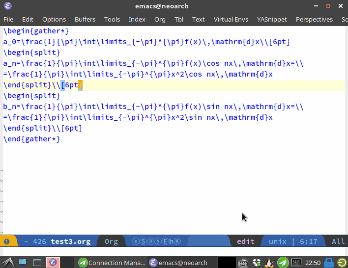
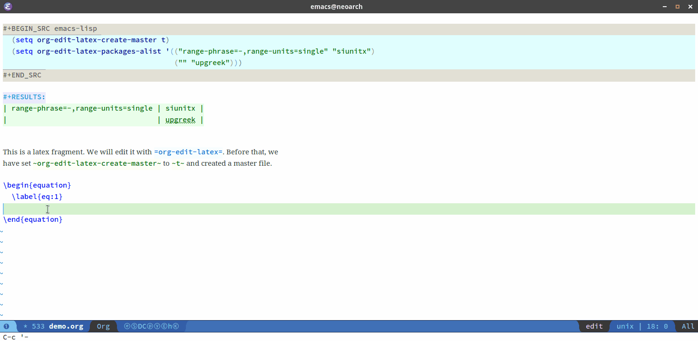

[](http://melpa.milkbox.net/#/org-edit-latex)

## Org Edit LaTeX

org-edit-latex.el is an extension for org-mode. It let you edit a latex
fragment/environment just like editing a src block, i.e. you can edit latex in a
edit buffer.



### Install

First, download `org-edit-latex` and add following to your init file:

```
(require 'org-edit-latex)
```

You should add `latex` to your `org-babel-load-languages`:

```
(org-babel-do-load-languages
 'org-babel-load-languages
 '((emacs-lisp . t)
   (latex . t)   ;; <== add latex to the list
   (python . t)
   (shell . t)
   (ruby . t)
   (perl . t)))
```

### Basic Usage
Turn on `org-edit-latex-mode` and use following commands to start/exit/abort a
edit buffer.

- `org-edit-special`: enter a dedicated LaTeX buffer.
- `org-edit-src-exit`: exit LaTeX buffer when you finished editing.
- `org-edit-src-abort`: quit editing without saving changes.

Note that all above commands are built-in Org commands and your current
keybindings will probably do the job.

Inline latex is also supported, but I don't recommend using this package on
simple inline math, such as math symbols, SI units, etc. For that use case, you
may check cdlatex, which is more than enough to handle that. The setup of
cdlatex is pretty straightforward, see
<https://github.com/jkitchin/scimax/issues/117> to get a general idea.

To get started, you may also want to check out
[yasnippet](https://github.com/joaotavora/yasnippet) to fast insert a latex
environment before you can use `org-edit-special` to enter the edit buffer.

### TeX Master
By default, `org-edit-latex` will generate a TeX-master file automatically. The
master file is used for:

- Completion in edit buffer via AucTeX
- Preview in the edit buffer

The LaTeX packages used by the master file is copied from
[org-preview](http://orgmode.org/worg/org-tutorials/org-latex-preview.html)
settings. 

The master file locates in the same directory as the org file does. You can
update the master file via `org-edit-latex-update-master` after changing the
preview settings.

You can use `org-edit-latex-preview-at-point` to preview in a edit buffer. By
default, the keybinding of `preview-at-point` (AucTeX) is remapped to this
function.

#### Demo
**w/o master:**


**with master:**


### Change Log
- 0.8.0 Add support for TeX-master; provide preview function.
- 0.7.0 Fix a few bugs regarding latex fragment/environment with name/caption/attrib.
- 0.6.3 Fix inline math issue caused by a bug from org.
- 0.6.2 src blocks will be untouched.
- 0.6.1 Fix inline src block not recognized.
- 0.6.0 Editing of inline latex (including non math latex fragments) is supported.
...

### TODO
- [x] Mention cdlatex
- [x] Mention yasnippet
- [x] Add more demo gifs
- [x] Add support for inline math.
- [x] Turn this feature into a minor mode. (by purcell)
